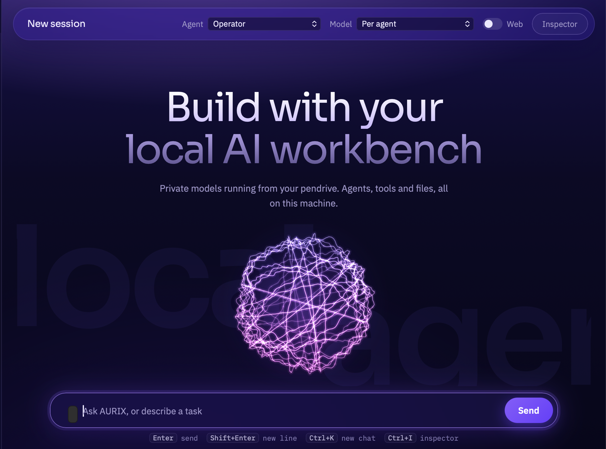

# AURIX

A portable, multi-agent AI workbench that runs entirely from a USB drive — no cloud, no
subscription, no internet required after setup. Plug it into any Mac, Windows, or Linux
machine and it boots a local LLM stack (llama.cpp + Qwen models) behind a full agent
system: task planning with review cycles, a permission manager that gates every
file/shell/browser action, long-term memory, document RAG, and a background task queue
with checkpointing — all through a custom web UI.



## Why
Most local-LLM setups are a single chat window. AURIX is closer to a small operating
system for agents: a **Team** mode plans a goal into steps and hands each to a
specialist (Researcher, Developer, Analyst, Operator), a reviewer checks the result and
triggers a fix round if needed, and every sensitive action — writing a file, running
code, clicking a browser button — waits for your explicit approval before it runs.

## Highlights
- **Zero cloud dependency** — models, memory, and documents all live on the drive
- **Multi-agent orchestration** — plan → execute → review → fix, not just prompt → reply
- **Permission-gated tool use** — safe/sensitive/dangerous tiers, nothing silent
- **Background tasks** — schedule a goal (once, interval, or daily), it runs unattended
  with checkpointed progress and automatic retry on failure
- **RAG knowledge base** — drop in PDFs/docs, agents search them automatically
- **Cross-platform launcher** — auto-detects CPU/GPU/RAM and picks the right binaries

## Setup & usage

Start: double-click `start.command` (Mac), `start.bat` (Windows) or run `./start.sh` (Linux).
AURIX opens at http://127.0.0.1:8765. The first start on a computer needs internet once:
uv downloads Python 3.12 and the packages into that computer's user cache.

## What's on the pendrive
- `aurix/`: the AURIX core (FastAPI) and web UI
- `bin/mac`, `bin/win`, `bin/linux`: llama.cpp builds + `uv` (portable Python runner)
- `models/`: your `.gguf` models (see "Vision" for the folder layout)
- `data/`: `workspace/` (the only folder file tools touch), `aurix.db` (chats, memory,
  documents, tasks), `settings.json`, `logs/`

## Agents
| Agent | Model tier | What it does |
|---|---|---|
| General | fast (2B) | Questions, explanations, memory |
| Researcher | strong (4B) | Web search, reading pages, your documents |
| Developer | code, else strong | Files, Python, shell, git |
| Data analyst | strong | CSV/Excel/JSON with pandas, charts |
| Operator | strong | Opens apps, AppleScript (Mac), automation browser, n8n |
| Team | strong manager | Plans steps, hands each to a specialist, reviews, fixes, answers |

"Automatic" picks by keywords; every choice is logged in `routing_log` (training data for Laya).

## Phase 4: Team mode
Pick **Team (plan, build, review)** in the Agent menu. The manager writes a plan of 1-5 steps
(as structured JSON, which small models do reliably), each step runs with its specialist, a
reviewer checks the result, and if it fails one fix step runs and is reviewed again
(Settings, Review rounds). Progress shows as a plan box in the reply.

## Phase 5: Memory and documents
- **Long-term memory:** say "remember that I deploy on Oracle Cloud", or add facts in the
  Knowledge panel. Relevant facts are added to every prompt (Settings, Memory).
- **Documents:** add text, code, Markdown, PDF or Word files in the Knowledge panel (they are
  copied to `workspace/knowledge/`). Agents search them with `search_documents`.
  Search uses BM25 keyword ranking: no extra model, no extra heat.

## Phase 6: Computer control
- `open_application`, `open_url`, `open_path`, `git` ask first (sensitive).
- `run_applescript` (Mac only) controls apps like Notes, Music, Finder, Mail drafts. It is
  dangerous-level: every script is shown to you before it runs.
- **Automation browser** (Playwright): `browser_open/read/click/fill/screenshot`. It uses your
  Google Chrome if installed; otherwise the first use downloads Playwright's Chromium once
  (about 150 MB). Clicking and filling ask first. Needs the Web switch on.

## Phase 7: Specialist models
- Tiers in Settings: fast, strong, code, vision. Leave "Automatic" to match `config.json` names.
- **Vision:** put the model in its own folder together with its `mmproj` file:
  ```
  models/Qwen3.5-4B-Q4_K_M/Qwen3.5-4B-Q4_K_M.gguf
  models/Qwen3.5-4B-Q4_K_M/mmproj-F16.gguf
  ```
  llama-server then starts it with vision enabled. Attach images with the picture button or
  paste them into the message box. Get the mmproj file from the same Hugging Face repo as the
  model ("Files and versions", the file whose name starts with `mmproj`).

## Phase 8: Voice
Mic button: speak, then click again to stop; the text lands in the message box.
Settings, "Read answers aloud" speaks replies with the computer's built-in voices.
Uses the browser's speech features, so no extra model runs. Note: in Safari and Chrome,
speech-to-text may be processed by Apple or Google, not on your computer.

## Phase 9: Portable runtime
The launchers detect the computer:
- Mac: Apple Silicon uses `bin/mac`; Intel Macs use `bin/mac-x64` (put the macos-x64 build there).
- Windows: NVIDIA GPU uses the CUDA build in `bin/win`; without NVIDIA it uses
  `bin/win-vulkan` or `bin/win-cpu` if you add those builds.
- Linux (x86_64): run `bash start.sh`. It uses `bin/linux-cuda` on NVIDIA, `bin/linux-vulkan`
  when Vulkan drivers are present, otherwise the CPU build in `bin/linux` (uv lives there too).
  If the distro mounts USB drives with "noexec", it runs the binaries from a temporary copy.
- RAM: 12 GB or more keeps 2 models in memory, otherwise 1 (`MAX_MODELS` in the launcher).
The Models panel shows what AURIX detected, with tips for that machine.

## Phase 10: Tasks (autonomous, background)
Tasks panel: give a goal, choose Team or one agent, autonomy and when to run:
now, once at a time, every N minutes, or daily at a time.
- Runs in the background while the launcher is open, even with the browser tab closed.
- **Checkpoints:** the plan and each finished step are saved; a failed task retries up to 3
  times (1, then 2 minutes later) and continues from the last checkpoint. Tasks interrupted
  by stopping AURIX become "paused": press Resume.
- **Autonomy:** "Ask" waits for approval before any sensitive or dangerous action;
  "Trusted" runs sensitive actions (like writing files) but still asks before code, shell
  commands and AppleScript. Waiting approvals appear at the top of the Tasks panel and as a
  badge on the Tasks icon.
- **n8n:** add your n8n URL (and API key to list workflows) in Settings. The Operator agent
  can list workflows and run them through their webhook paths.
- Keep "Tasks running at once" at 1 on a fanless Mac.

## Permissions (Settings, Tool permissions)
- safe: runs immediately
- sensitive: asks (chats can allow for the rest of the chat; trusted tasks run it)
- dangerous (run_python, run_shell, run_applescript): asks every time, everywhere
Python and shell commands start in `data/workspace` but are NOT sandboxed.
